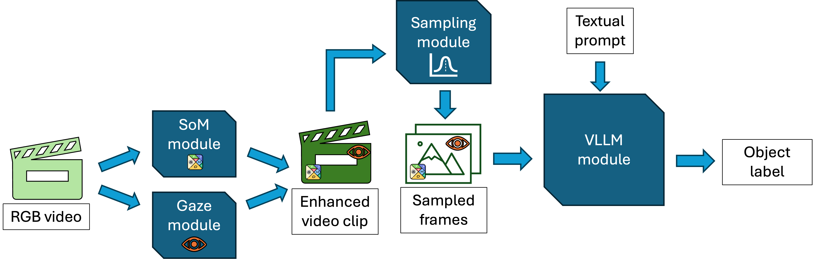

# Leveraging Gaze and Set-of-Mark in VLLMs for Human-Object Interaction Anticipation from Egocentric Videos

[](https://opensource.org/licenses/MIT)

This repository contains the official implementation of the paper **"Leveraging Gaze and Set-of-Mark in VLLMs for Human-Object Interaction Anticipation from Egocentric Videos"**.

We propose a methodology to enhance Vision Large Language Models (VLLMs) for human-object interaction anticipation using:
1.  **Set-of-Mark (SoM)** for visual grounding.
2.  **User Gaze Trajectories** for user intent understanding.
3.  **Inverse Exponential Sampling** for a temporal context-based frame sampling.



## 🛠️ Hardware Requirements

- **GPU:** NVIDIA GPU with at least 16GB of VRAM (Flash Attention 2 support recommended).
- **Storage:** ~2.5TB space required for the dataset and processed video clips.

## Dataset
In this work, we used the **HD-EPIC** dataset. Please refer to their [website](https://hd-epic.github.io) for instructions on downloading the data.

## ⚙️ Installation & Environments

⚠️ **Important:** Due to conflicting dependencies between legacy tools (SoM requires old NumPy) and modern tools (Project Aria requires new NumPy), we utilize **three separate Conda environments**.

Please carefully follow the instructions below to set them up. All the environments `.yaml` files are located in the `envs` folder.

### 1. Clone the repository
```bash
git clone https://github.com/danielemateria/object_interaction_anticipation_with_vllms.git
cd object_interaction_anticipation_with_vllms
```

### 2. Set-of-Mark environment setup
#### Create the base conda environment
```bash
conda env create -f envs/environment_som_full.yaml
```

#### Activate it
```bash
conda activate obj_ia_som_env
```

#### Install CUDA development libraries
```bash
conda install -c "nvidia/label/cuda-11.8.0" cuda-cudart-dev libcublas-dev libcusolver-dev libcusparse-dev
```

#### Install PyTorch
```bash
pip install torch==2.0.1+cu118 torchvision==0.15.2+cu118 torchaudio==2.0.2+cu118 --index-url https://download.pytorch.org/whl/cu118
```

#### Setup environment variables
```bash
export CUDA_HOME=$CONDA_PREFIX
export CPATH=$CONDA_PREFIX/include:$CPATH
export LIBRARY_PATH=$CONDA_PREFIX/lib:$LIBRARY_PATH
export LD_LIBRARY_PATH=$CONDA_PREFIX/lib:$LD_LIBRARY_PATH
```

#### Install other SoM-specific dependencies
```bash
pip install git+https://github.com/UX-Decoder/Segment-Everything-Everywhere-All-At-Once.git@package
pip install git+https://github.com/facebookresearch/segment-anything.git
pip install git+https://github.com/UX-Decoder/Semantic-SAM.git@package
```

#### Compile Ops:
Go to the `src/third_party/SoM/ops` folder and:
1. change the path at line 15 of make.sh from `/usr/local/cuda/bin/nvcc` to your local `nvcc` installation. The path to your local `nvcc` binary is `$CUDA_HOME/bin/nvcc`, where `$CUDA_HOME` is one of the environment variables we created before.
2. run:
```bash
bash make.sh
```

#### Then, download the models checkpoints necessary for SoM:
```bash
cd ../
chmod +x download_ckpt.sh
./download_ckpt.sh
```
Now your SoM environment is ready!

*The code in the `src/third_party/SoM` folder comes from the [Set-of-Mark prompting](https://som-gpt4v.github.io) official release on GitHub*

### 3. Gaze environment setup
#### Create the base conda environment
```bash
conda env create -f envs/environment_gaze_full.yaml
```

And... that's it! The environment is ready.

### 4. Inference environment setup
The same as the gaze environment happens with the inference env: nothing needs to be manually installed after creating the environment with
```bash
conda env create -f envs/environment_inference.yaml
```


## 🚀 Usage Pipeline

The pipeline consists of three main steps. Please ensure you activate the specified Conda environment for each step.

### Step 1: Clip Extraction
*Environment: `obj_ia_som_env`*

Extracts the benchmark clips from the raw HD-EPIC videos using the timestamps provided in the repository (which have been extracted from the dataset annotations).

* **--dataset_path**: Path to the folder containing the raw HD-EPIC videos.
* **--output_path**: Target folder where the `video_segments` directory will be created.

```bash
conda activate obj_ia_som_env

python src/data_processing/extract_video_clips.py \
    --dataset_path /path/to/hd_epic_dataset/videos \
    --clips_timestamps_path src/data_processing/clip_timestamps.csv \
    --output_path /path/to/hd_epic_dataset/video_segments
```

### Step 2: Frame Annotation

We recommend applying Set-of-Mark prompting to the clips before the gaze, to ensure that the gaze trajectories in the `som_gaze` modality don't get altered by the semantic masks.

#### A. Generate and apply SoM masks to the last frame of each video

*Environment: `obj_ia_som_env`*

* **--video_segments_path**: The folder containing the standard RGB video clips extracted with the `extract_video_clips.py` script.
* **--gaze**: Set to True only if you are processing clips that already have Gaze (reverse order). For the standard pipeline, keep this set to `False`.

```bash
conda activate obj_ia_som_env

python src/data_processing/som_last_module.py \
    --video_segments_path /path/to/extracted/video/segments \
    --output_path /path/to/output/folder
    --gaze False \
    --gpu 0
```

This creates the `SoM_last_video_segments` folder at the specified videos path.

#### B. Apply gaze to the videos

*Environment: `obj_ia_gaze_env`*

Applies the user gaze trajectory to the videos. If you completed Step 2A, you can set `--som True` to draw gaze on top of the SoM-augmented clips, or leave it false to draw the gaze on standard RGB clips.

* **--videos_path**: The folder containing the HD-EPIC videos.
* **--video_segments_path**: The folder containing the standard RGB video clips extracted with the `extract_video_clips.py` script.
* **--gaze_path**: Path to the raw HD-EPIC gaze data folder.
* **--vrs_path**: Path to the raw HD-EPIC VRS files.
* **--output_path**: Path to the output folder, a subfolder will be created with the gaze-enhanced clips inside.
* **--som**: Set to True if the clips you're processing are `SoM`-enhanced. Set to False for standard clips. This will only add "SoM_last" before "Gaze" in the output folder's name that will be created under ´output_path´.

```bash
conda activate obj_ia_gaze_env

python src/data_processing/gaze_trajectory_module.py \
    --videos_path /path/to/hd_epic_dataset/videos \
    --video_segments_path /path/to/extracted/video/segments \
    --output_path /path/to/output/folder \
    --gaze_path /path/to/hd_epic_dataset/gaze_data \
    --vrs_path /path/to/hd_epic_dataset/vrs_files \
    --timestamp_path src/data_processing/clip_timestamps.csv \
    --som True
```

Output: Creates `Gaze_video_segments/` folder (or `SoM_last_Gaze_video_segments/` if `som=True`) and saves the gaze-annotated clips there.

### Step 3: Model Inference
*Environment: `obj_ia_inf_env`*

Run the evaluation using the desired model. The scripts automatically changes the VLLMs' prompt depending on the `--mode` argument's value.

* **--video_clips_path**: The folder containing the video clips. Note that the type of clips (standard, som, gaze, som_gaze) must be coherent with the chosen `--mode`.
* **--annotations_path**: The folder containing the `gaze_interaction_anticipation.json` file from the HD-EPIC annotations `vqa_benchmark` folder.
* **--mode**: The modality to test. Options: standard, gaze, som, som_gaze, som_last, som_last_gaze.

#### Option A: LLaVA-OneVision

```bash
conda activate obj_ia_inf_env

python src/inference/obj_ia_inf_llava_ov.py \
    --video_clips_path /path/to/input/video/clips \
    --annotations_path /path/to/hd_epic_annotations \
    --mode som_gaze \
    --lamb 1.0 \
    --sample 10 \
    --gpu 0
```

#### Option B: Gemini 2.0 Flash

Requires a valid Google API key.

```bash
conda activate obj_ia_inf_env

python src/inference/obj_ia_inf_gemini.py \
    --video_clips_path /path/to/input/video/clips \
    --annotations_path /path/to/hd_epic_annotations \
    --mode som_gaze \
    --fps 1
```